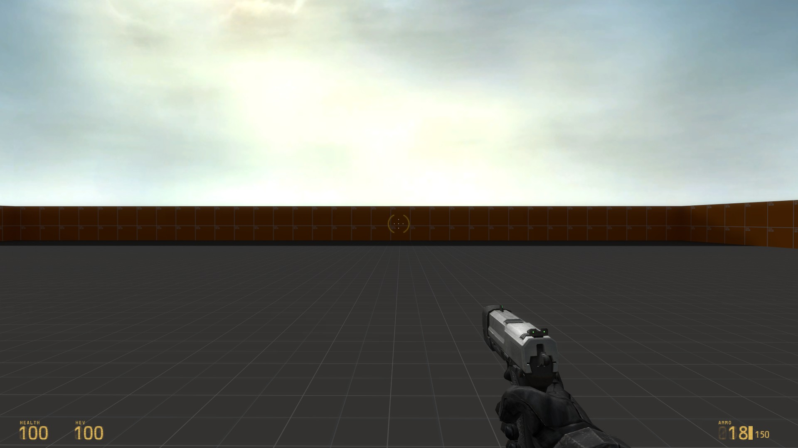

# HL2 Old Hud

## Many changes and additions to hud_bitmapnumericdisplay.cpp functionality
- setting and painting the labels (health, ammo, suit)
- adding faded zeros behind main numbers
- new console variable hud_draw_backgrounds to show the background to the hud elements

## Changes to hud_health.cpp, hud_ammo.cpp, hud_battery.cpp
- changes all of these hud elements to use CHudBitmapNumericDisplay instead of CHudNumericDisplay (old font based number rendering)

## Changes to hud_quickinfo.cpp
- changed quickinfo around crosshair to the sprite based one from the leak

## hud_redraw.cpp and hud.h
- changed code for DrawIconProgressBar to work with old hud elements

## Instructions:
1. Copy code changes from above into your own codebase and compile it
2. Grab the following files from mod_episodic or mod_hl2 folder:
    - scripts\mod_textures.txt
    - scripts\hud_textures.txt
    - scripts\HudLayout.res
    - materials\sprites\hud1.vmt
    - materials\sprites\hud1.vtf
3. Add these files to your mod folder
4. Run your mod 
